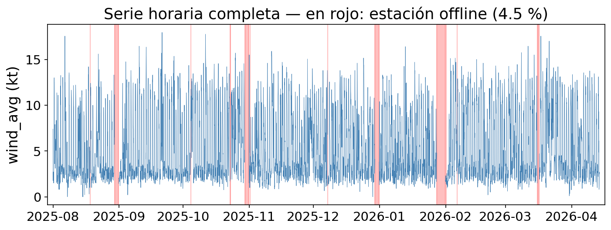
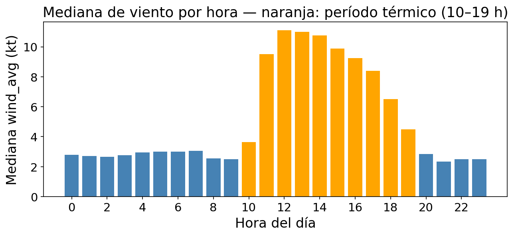
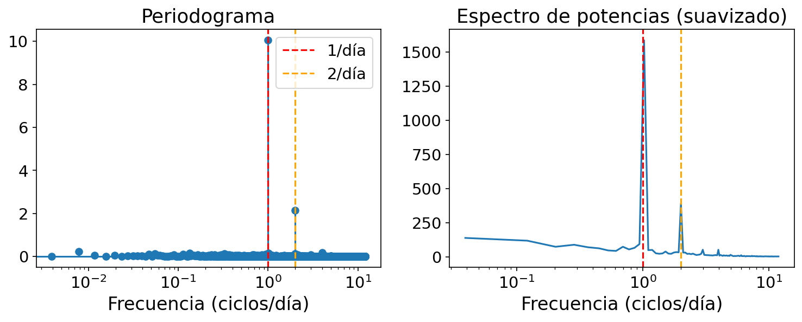
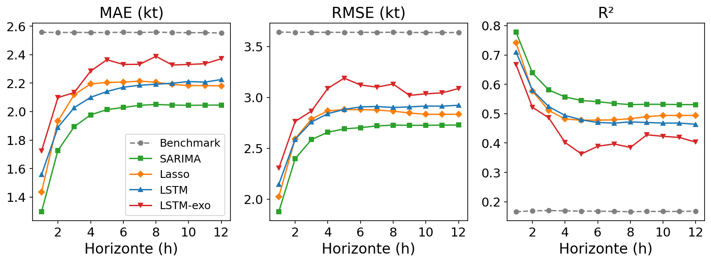
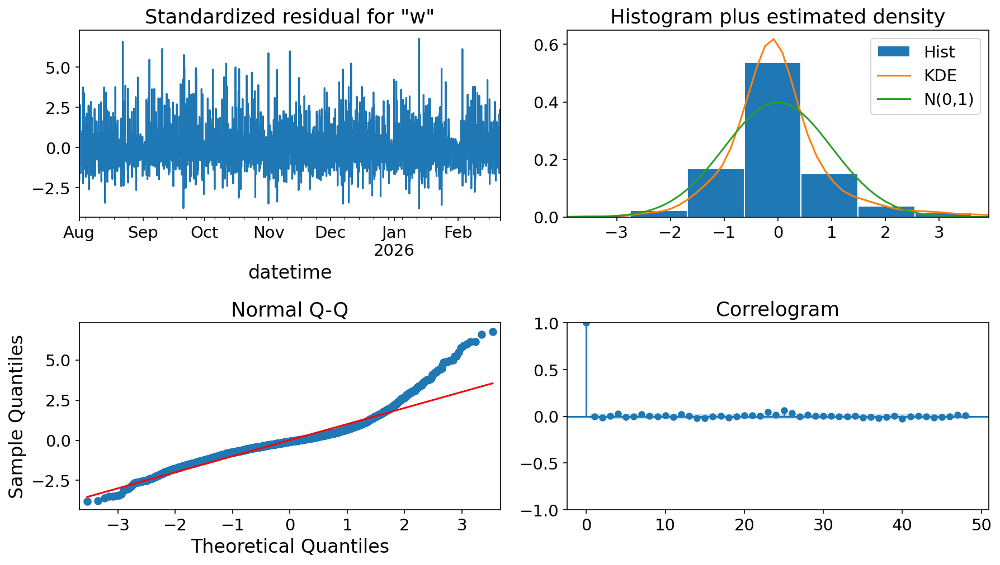

# Pronóstico de viento en Potrerillos

Trabajo Práctico Final Integrador — *Análisis de Series de Tiempo y Pronósticos*
Universidad Nacional de San Martín (UNSaM) · 1er cuatrimestre 2026

**Grupo 9**
- Lucas Achaval — lachavalrodriguez@estudiantes.unsam.edu.ar
- Marcos Achaval — machavalrodriguez@unsam-bue.edu.ar

---

## Descripción del problema

Potrerillos (Mendoza) es un embalse de montaña cuya actividad náutica depende del viento térmico. El objetivo del trabajo es pronosticar la velocidad media del viento (`wind_avg`, en nudos) con un **horizonte de 12 horas** (una predicción por hora) a partir de datos históricos de la estación meteorológica local.

## Datos

| Atributo | Valor |
|---|---|
| Fuente | [Windguru — estación 15338](https://www.windguru.cz/station/15338) |
| Estación | Ecowitt WS90 (Club Náutico Potrerillos) |
| Rango | ago 2025 – abr 2026 (~8.5 meses) |
| Frecuencia original | 1 dato/min → resampleado a **1 hora** |
| Agregación | mediana para variables lineales, media circular para dirección |
| Valores faltantes | ~4.5 %, 12 gaps de estación (sin imputar) |



**Variables:**

| Variable | Tipo | Descripción |
|---|---|---|
| `wind_avg` | Endógena | Velocidad media del viento (nudos) |
| `wind_max` | Exógena | Ráfaga máxima (nudos) |
| `wind_min` | Exógena | Velocidad mínima (nudos) |
| `wind_direction` | Exógena | Dirección del viento (°) |
| `temperature` | Exógena | Temperatura (°C) |
| `rh` | Exógena | Humedad relativa (%) |
| `mslp` | Exógena | Presión a nivel del mar (hPa) |

## Metodología

La evaluación de todos los modelos usa **walk-forward** con split 80/20 cronológico y métricas (MAE, RMSE, R²) reportadas por horizonte h = 1…12.

### Análisis exploratorio

- Ciclo térmico diario dominante: calma nocturna (~1–2 kt), pico 11–16 h (~9–11 kt).
- Sin tendencia de largo plazo.
- ACF lag 24: +0.5; ACF lag 12: negativo (antifase día/noche); PACF con información directa solo en lags 1–2 y ~24.
- ADF confirma estacionariedad (p ≈ 7.6×10⁻²¹, sin diferenciar).
- Periodograma: pico dominante en 1 ciclo/día y secundario en 2 ciclos/día.





### Modelado y resultados

| Modelo | MAE (kt) | RMSE (kt) | R² | Δ RMSE vs benchmark |
|---|---|---|---|---|
| **SARIMA(2,0,1)(1,0,1,24)** | **1.9** | **2.6** | **0.57** | **−28 %** |
| LassoCV | 2.1 | 2.8 | 0.52 | −24 % |
| LSTM | 2.1 | 2.8 | 0.51 | −23 % |
| LSTM + exógenas | 2.3 | 3.0 | 0.44 | −18 % |
| Persistencia estacional (benchmark) | 2.6 | 3.6 | 0.17 | — |



**Benchmark:** persistencia estacional — ŷ(t+h) = y(t+h−24).

**LassoCV:** 31 features (24 lags + 5 exógenas + sin/cos hora), gap de 12 h para evitar fuga, 12 modelos directos (uno por horizonte).

**SARIMA:** selección de orden por grid search AIC sobre p∈{0,1,2}, q∈{0,1}, P,Q∈{0,1} con S=24. Residuos sin autocorrelación; colas pesadas en Q-Q.



**LSTM:** ventana W=48, salida directa H=12, early stopping. Agregar exógenas mejora validación pero empeora test (overfitting).

### Conclusiones

- La señal está casi íntegramente en el ciclo térmico de 24 h y la autocorrelación de corto plazo.
- SARIMA, el modelo más simple entre los no-triviales, supera a Lasso y LSTM en las tres métricas.
- Las exógenas pasadas no mejoran el pronóstico — el ciclo de hora ya las resume.
- El error crece rápido de h=1 a h=3 y luego meseta: más allá de 3 h la predicción se apoya en el ciclo diario, no en la historia reciente.

### Trabajo futuro

- SARIMAX con exógenas pronosticadas (NWP) para horizontes largos.
- GARCH para modelar varianza condicional e intervalos honestos (colas pesadas).
- Encoding circular de dirección (sin/cos) como feature explícita.

## Estructura del repositorio

```
.
├── data/
│   └── station_15338.csv        # Serie horaria (ago 2025 – abr 2026)
├── src/
│   ├── entregable_1.ipynb       # EDA: descripción, estacionariedad, ACF/PACF, espectro, LassoCV
│   ├── entregable_2.ipynb       # Benchmark, SARIMA, LSTM, comparación final
│   └── entregable_2_exo*.ipynb  # Experimentos con variables exógenas en LSTM
├── docs/
│   ├── TS-2026-1C_1er-entregable.md/pdf  # Consignas del 1er entregable
│   └── TS-2026-1C_2do-entregable.md/pdf  # Consignas del 2do entregable
├── presentacion/
│   ├── presentacion.tex/pdf     # Slides de la presentación final
│   ├── gen_figs.py              # Generación de figuras para slides
│   └── figs/                   # Figuras exportadas
└── requirements.txt
```

## Instalación

```bash
pip install -r requirements.txt
```

Dependencias principales: `pandas`, `numpy`, `scikit-learn`, `statsmodels`, `tensorflow`/`keras`, `matplotlib`.
